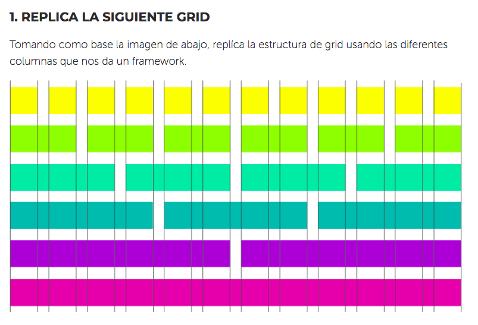

# Notas Grid
Crea una web que replique el grid que esta como ejemplo.

## Pseudocódigo para Grid
1. Dividir las columnas, nuestra base son 12 columnas, elegir el color y tomar en cuenta los gutters.
2. Hacer las rows necesarias.
3. .

